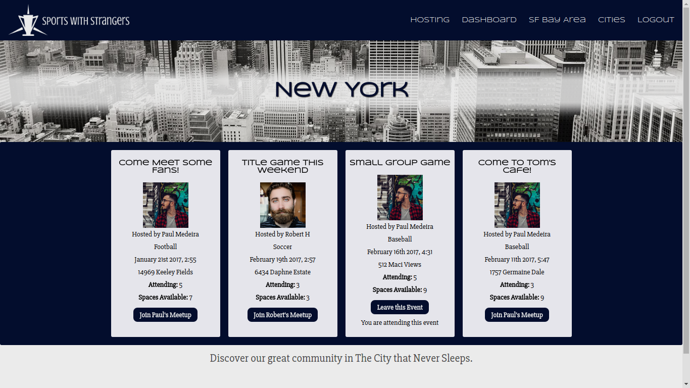
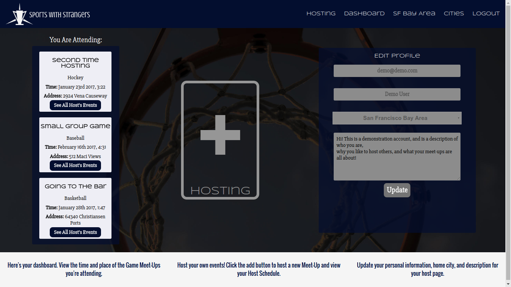

[TeaWithStrangers]: http://www.teawithstrangers.com/

# SportsWithStrangers
Sports With Strangers is a full-stack web application taking inspiration from [Tea With Strangers][TeaWithStrangers].
The application was built using Ruby-on-Rails with PostgreSQL for backend data management, and React.js with Redux to contain state on the frontend.

[Sports With Strangers Live](http://www.sportswithstrangers.online)

## Overview

Sports With Strangers is a meet-up application based around sporting events, with the aim to give users the ability to find and meet others who share their passion for a given sport, league, or team. The smaller number of cities and events helps to create a tight host-based community, wherein the host users from each city can build a positive reputation and in doing so encourage new users to attend meet-ups for the first time.


## Implementation of Features

### React & React Router

Sports with Strangers is served entirely in a single page. Thanks to `react-router`, the application respond to the address bar normally, while never having to make a new HTTP-Request until reload. Restricted paths are still protected, as certain routes can only be accessed when the application state meets a given criteria.

### Assigning Home Cities To Users

When a user decides chooses a city upon sign-up or changes it upon profile edit, the frontend only has access to the name of the city the user submitted. When the API request reaches the backend, Active Record queries the database for the city matching that name, and assigns ther user's `city_id` prior to database validation.

`before_validation :set_city_id, :format_email, :set_default_image`...

```ruby
def set_city_id
  city = City.find_by(name: self.location)
  self.city_id = city.id if city
end
```

###Listing Events by Host or City

  In the database events hold a foreign_key of `city_id`, as well as `host_id` which corresponds to a row in the users column. Because `GET` requests to `api/events` are all handled by `EventsController#index`, the controller responds based on the foreign_key it is given. Because events are fetched by their database associations and not their own id, the AJAX GET request sends a long the foreign_key as well. The controller responds with either a city's events or a host's events depending on the foreign_key it recieved.

  ```ruby
  def index
    if event_params[:city_id]
      city = City.find(event_params[:city_id])
      render json: ['City not found'], status: 404 if city.nil?
      @events = city.events
      render json: ["No events scheduled in #{city.name}."], status: 422 if @events.empty?
    elsif event_params[:host_id]
      host = User.find(event_params[:host_id])
      render json: ['User not found'], status: 404 if host.nil?
      @events = host.events
      render json: ["#{user.name} isn't hosting any events."], status: 422 if @events.empty?
    end
  end
  ```
### Listing A User's Attended Events

Attendance for events is stored in the database using a join table, which holds an `event_id`, and a `user_id` to link users to their attending events. When a user logs in, an AJAX call is made to retrieve and store a user's information as well as the events they are attending. The information is sent back in `JSON` format via jbuilder. The decision to store the current user's events was made to avoid making new requests every time a user visited their dashboard. The `EventList` react component also needs commonly make requests to fetch a new list by host, or by user, but only once upon login for attendance.

```ruby
json.extract! @user, :email, :name, :location, :image, :city, :blurb
json.set! :attending, @user.attending do |event|
  json.title event.title
  json.time event.time
  json.address event.address
  json.capacity event.capacity
  json.sport event.sport
  json.city_id event.city_id
  json.id event.id
end
```

### Joining Events & Event Capacity

  When user visits a city's page, react first checks that the user is logged in before continuing. Then an AJAX call is made using the `react-router` params to fetch the correct events. These events are rendered in a list component. Each event has a `capacity` cell in the database, and is returned from the backend with the number of attendees, so the two can be compared.
    ```ruby
    @events.attendees.length
    ```


  When each event item is rendered the difference is calculated, and the button is disabled if the capacity has been met. The current user's id is also checked against the host id, in order to disable the button if the current user is hosting that event.

  ```javascript
  if (this.props.attending.includes(event.id)) {
    return (
      <div>
      <input type='submit' value={'Leave this Event'}
        className='button'
        onClick={() => this.leaveEvent(this.props.currentUserId, event.id)} />
      <p>You are attending this event</p></div>
    );
  } else if (event.host.id === this.props.currentUserId) {
    return (
      <div>
      <input type='button' disabled value={'Cannot Join Own Event'}
        className='button-disabled'/>
      <p>You are hosting this event</p></div>
    );
  } else if (event.attending >= event.capacity) {
    return (
      <div>
      <input type='button' disabled value={'No Spaces Left'}
        className='button-disabled'/>
    </div>
  );
}

```

The challenge was to retrieve the information needed to achieve each state of each event items, but without retrieving and storing unnecessary objects. Only the id's from the attending users are fetched to be compared with the host and the counted against capacity.

###  User Dashboard and Editing User Information

One of the great things about react is the ease in having a single path for all users to share. You are able to display and edit the current user's information without ever having to make another request after initial login. The 'edit profile' form is pre-filled with the information contained in the `redux-store`, and is reflected in the react component's state. Upon logout, the data used to fill the personal information is discarded by the frontend, and there is no risk of another user gaining access to someone else's dashboard by URL tampering.



React also allows you to set boolean values in JSX to be compiled into HTML. I am able to disable a form until the user decides they want to interact with it, something that cannot be done in HTML so eloquently.

```HTML
  <input type='email'
  disabled={this.state.disabled}
  value={user.email}
  onChange={this.update('email')}/>
```

I chose to handle any errors with the update form without dispatching actions to the redux store. It made it simple to display a success message when the PATCH request was successful, and let the user know what they missed otherwise. I utilized `setTimeout`, and `setState`'s optional callback to display the success/failure message for five seconds.

```javascript
handleSubmit() {
  this.props.updateUser(this.state).then(
    res => this.setState({prompt: 'Successfully Updated'},
     () => setTimeout(() => this.setState({prompt: ''}), 5000)),
    res => this.setState({prompt: res.responseJSON.map(err => ` ${err}. `)},
    () => setTimeout(() => this.setState({prompt: ''}), 5000)));
}
```
While not typical, utilizing success and failure callbacks in this manner worked well in this particular case since the data would be discarded almost immediately anyway.

##Future Directions for Project

### Personalize Event Lists
- [ ] Filter Events by Sport
- [ ] List preferred Sports for Users

### Hosts Search
- [ ] Search Hosts by Sport
- [ ] Search Events by Host, or Sport

### API Integration
- [ ] Integrate a public API to show sports statistics, or schedules if available.
- [ ] Integrate Google Maps API for event location.

### Smart Events
- [ ] Suggestions based on favorite team, or previous attendance.
